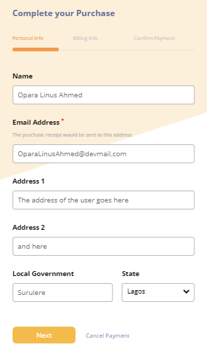
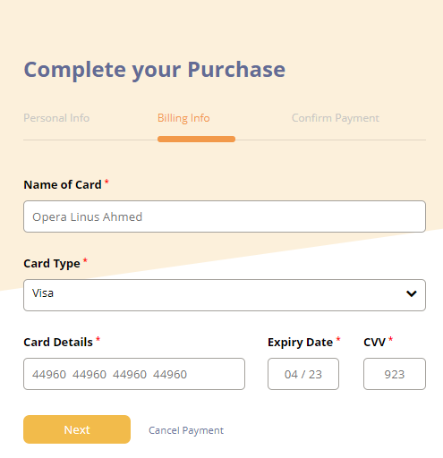
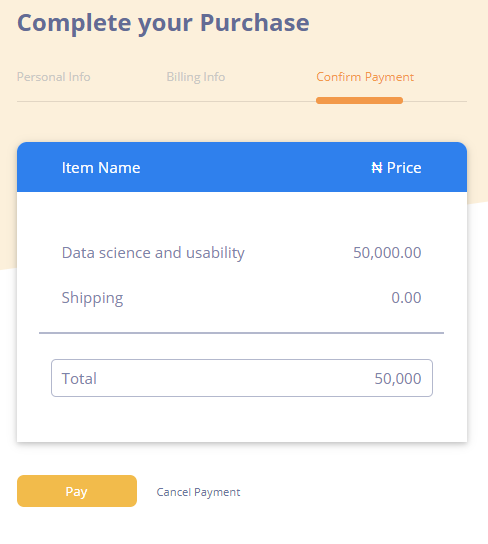
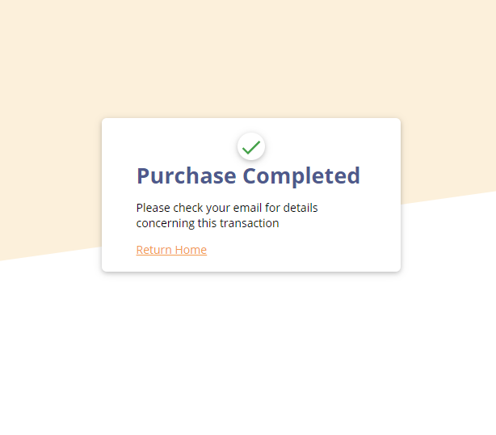

<h1>Payment App</h1>
Demo:<a href="https://master.dkwqoa2u34153.amplifyapp.com/">https://master.dkwqoa2u34153.amplifyapp.com/</a>

This App was built using ReactJS

<h3>Technologies used</h3>
<ul>
<li>ReactJS</li>
<li>Css - Pure CSS was used, no third party styling library was used </li>
<li>CleaveJs - For ATM Card validation</li>
<li>React-router-dom - For routing within the App</li>
<li>Jest & Enzyme for testing</li>
</ul>

<h3 >Images</h3>

This App is hosted on AWS (<a href="https://master.dkwqoa2u34153.amplifyapp.com/">https://master.dkwqoa2u34153.amplifyapp.com/</a>)
